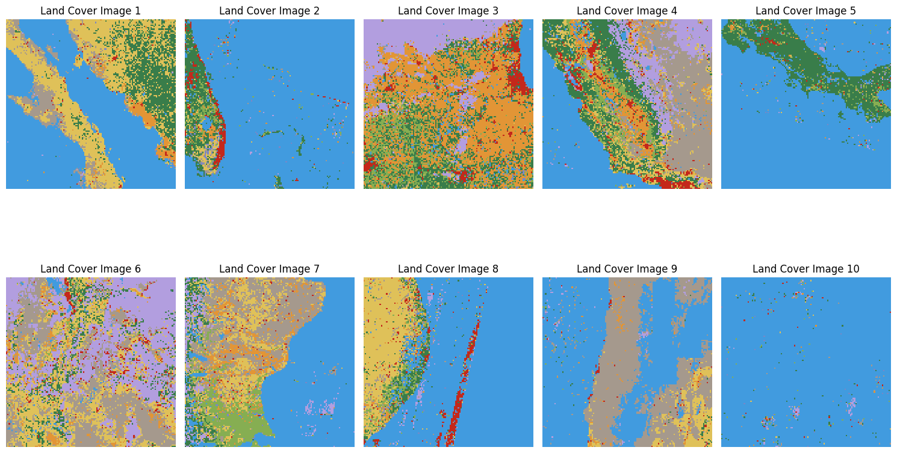

# NYU CS-GY 6513 Big Data Project

## Made by Rohit, Aakash, Anirudh, and Dyanesh

This project aims to build models that can predict the land cover and land surface temperature 6 months into the future using Satellite imagery.

### Dataset
- Landsat-8 by NASA (https://landsat.gsfc.nasa.gov/satellites/landsat-8/)
- MODIS by NASA (https://modis.gsfc.nasa.gov/)
  
### Tech Stack
- Python
- Flax/JAX
- Modal
- Tensorboard
- Apache Beam
- Google Earth Engine

### Sample Inference images

*Land Cover Labels*

*Land Cover Predictions*

*Land Surface Temperature Labels*

*Land Surface Temperature Predictions*